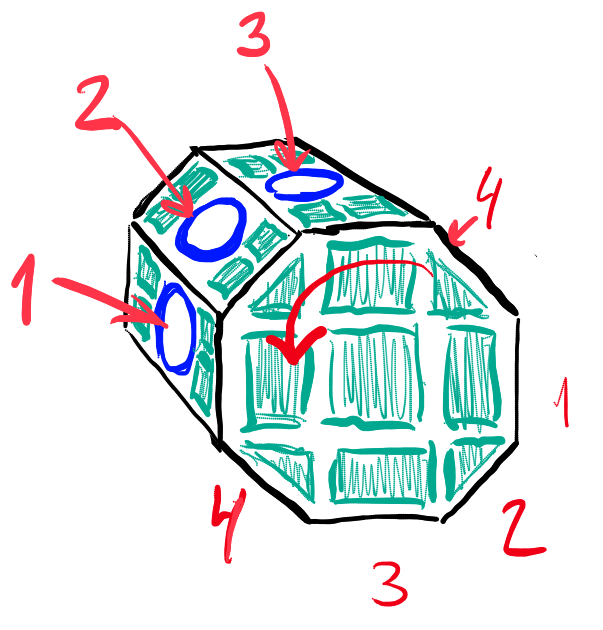
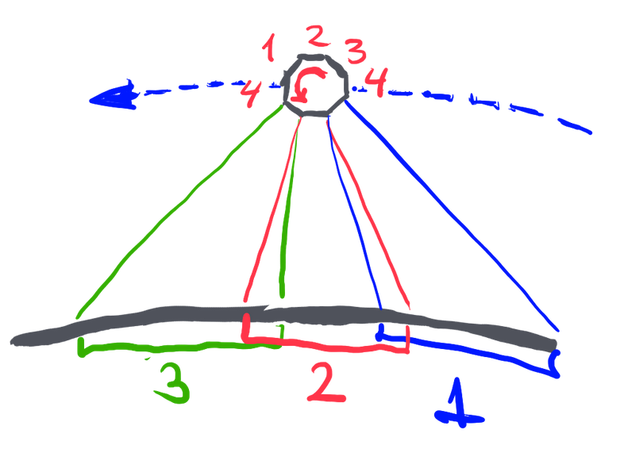
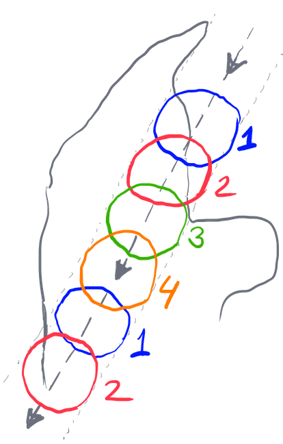

# Dynamical Coverage Area Satellite
Suggestions for a LEO/MEO satellite that has multiple antennas located around its surface. It rotates as it orbits the earth, whereby the antennas are dynamically deployed.

Lars Weje Hangstrup, Storvorde, 21 may 2022

## Disclaimer
I know virtually nothing about satellite construction, directive antennas, power consumption of satellites, and so on. This document is just a way to get some qualified feedback from others.

1. Multiple antennas are placed around the satellite (figure suggests 8, octagonal prism). Surfaces not used for antenna are likely used for solar panels.
2. The satellite is rotating as suggested by the arrow
3. The rotation speed is synchronized with the ground speed
4. The shape could be an octagonal prism (like the figure above) or perhaps hexagonal (6) or ennegonal (9), or perhaps simply cylindrical.

5. As the satellite moves over the surface of the earth, at least 2 antennas will be facing the ground (figure suggests 3 antennas providing coverage)
6. Antennas not facing the earth should be switched off to conserve power
7. Adaptive antenna design can perhaps be applied to ensure that area 1 and 3 are the same as 2

8. The resulting ’footprint’ on the ground will be something like the figure above.
9. The drawing assumes 8 antennas, which would allow for a reuse pattern (frequency, cell id, …) that is 1, 2, 3, 4, 1, 2, 3, 4 (or 1, 2, 3, 1, 2, 3, 1, 2…..)
10. Any number of antennas can be envisaged, but probably no less than 6 (?) due to the angle of the antenna beams.

## Motivation
LEO systems are facing challenges like:
- How is a ’location area’ and ’tracking areas’ defined? How are these established and maintained as the satellite moves over the ground?
- When crossing country borders, regulatory rules may require:
    - Usage of other frequencies. How do we switch these on and off with minimum disruption.
    - Completely disabling the service, but keeping existing connections as long a possible.
    - Usage of other RAN technologies, while maintaining existing connections.

## Keyword searches
Several google searches (for images) performed, with various hits, but nothing suggesting ’rotating antennas’:
- satellite multiple antennas
- satellite multiple antennas rotate
- leo satellite rotate
- satellite hexagonal
- satellite octagonal
    - https://www.globalsecurity.org/space/world/brazil/scd.htm
    - https://space.skyrocket.de/doc_sdat/scd-2.htm
    - https://directory.eoportal.org/web/eoportal/satellite-missions/o/ors-4